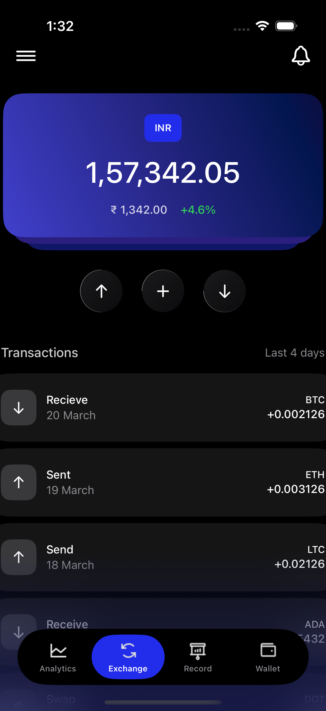
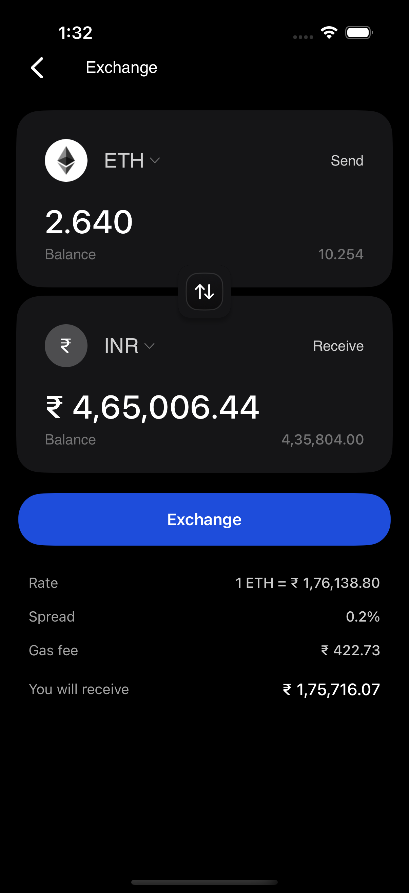

# 🚀 Crypto Portfolio App

A beautiful and modern cryptocurrency portfolio tracking app built with **SwiftUI**. Track your crypto investments, view detailed charts, exchange currencies, and manage your digital assets with an elegant dark theme interface.

## 📱 Screenshots

<!-- Add your app screenshots here -->
| Portfolio View | Exchange View | Exchange Detail |
|---|---|---|
|  |  |  |

*More screenshots coming soon...*

## 🚀 Quick Setup

### Prerequisites
- **Xcode 15.0+** (recommended)
- **iOS 17.0+** deployment target
- **macOS 14.0+** for development

### Installation Steps

1. **Clone the Repository**
   ```bash
   git clone https://github.com/yourusername/crypto-portfolio-app.git
   cd crypto-portfolio-app
   ```

2. **Open in Xcode**
   ```bash
   open CryptoPortfolio_Assignment.xcodeproj
   ```
   
   Or simply double-click the `.xcodeproj` file in Finder.

3. **Select Target Device**
   - Choose your target device or simulator from the scheme selector
   - For best experience, use iPhone 16 Pro

4. **Build and Run**
   - Press `Cmd + R` or click the "Play" button
   - The app will automatically build and launch on your selected device

5. **Enjoy!** 🎉
   - The app comes with pre-populated mock data
   - No additional setup or API keys required

### 📱 Device Compatibility
- **iPhone**: iOS 17.0+ (iPhone 12 and newer recommended)
- **iPad**: iPadOS 17.0+ (adaptive layout coming soon)
- **Simulator**: Any iOS 17.0+ simulator

## ✨ Features

### 📊 Portfolio Management
- **Real-time Portfolio Value**: Track your total investment value with Indian currency formatting
- **Multi-Currency Support**: Switch between INR (₹) and Bitcoin (₿) display
- **Interactive Charts**: Visualize portfolio performance over different timeframes (1h, 8h, 1d, 1w, 1m, 6m, 1y)
- **Asset Overview**: View individual cryptocurrency holdings with current prices and changes

### 💱 Exchange Interface
- **Currency Exchange**: Seamless crypto-to-fiat exchange interface
- **Live Exchange Rates**: Real-time conversion rates with spread and gas fee calculations
- **Swap Functionality**: Easy currency pair swapping with smooth animations
- **Transaction Preview**: Detailed breakdown of exchange costs and final amounts

### 📈 Advanced Charts
- **Multiple Timeframes**: Flexible chart viewing across various time periods
- **Interactive Data Points**: Touch and explore specific data points on charts
- **Smooth Animations**: Fluid chart transitions and interactions
- **Indian Currency Formatting**: Proper lakhs and crores formatting (₹ 12,34,567.89)

### 🔄 Transaction History
- **Recent Transactions**: Track all your crypto activities
- **Transaction Details**: View amounts, dates, and transaction types
- **Multiple Asset Support**: Bitcoin, Ethereum, and other cryptocurrencies
- **Clean Interface**: Easy-to-read transaction cards with icons

### 🎨 Design Excellence
- **Dark Theme**: Modern dark interface optimized for extended use
- **Glassmorphism Effects**: Beautiful frosted glass UI elements
- **Gradient Accents**: Subtle gradients and visual effects
- **Responsive Layout**: Adaptive design for different screen sizes
- **Custom Components**: Reusable UI components for consistency

## 🛠 Technical Architecture

### 📁 Project Structure
```
CryptoPortfolio_Assignment/
├── 📱 Views/
│   ├── PortfolioView.swift          # Main portfolio dashboard
│   ├── ExchangeView.swift           # Currency exchange interface
│   ├── ExchangeDetailView.swift     # Detailed exchange screen
│   ├── WalletView.swift             # Wallet management (Coming Soon)
│   ├── RecordView.swift             # Transaction records (Coming Soon)
│   └── 🧩 Components/
│       ├── TopNavigationBar.swift   # Reusable navigation
│       ├── CryptoAssetCard.swift    # Asset display cards
│       ├── ChartView.swift          # Interactive charts
│       ├── TransactionRowView.swift # Transaction display
│       ├── GradientActionButton.swift # Styled action buttons
│       └── [More components...]
├── 🗃 Models/
│   ├── Portfolio.swift              # Portfolio data structure
│   ├── CryptoAsset.swift           # Cryptocurrency model
│   ├── Transaction.swift           # Transaction model
│   └── ChartDataPoint.swift        # Chart data structure
├── 🔧 ViewModels/
│   └── PortfolioViewModel.swift     # Portfolio business logic
├── 🌐 Services/
│   └── MockDataService.swift       # Data service layer
└── 🔧 Extensions/
    ├── Color+Extensions.swift       # Color utilities
    ├── View+Extensions.swift        # View modifiers
    └── Number+Extensions.swift      # Indian currency formatting
```

### 🏗 Key Technologies
- **SwiftUI**: Modern declarative UI framework
- **MVVM Architecture**: Clean separation of concerns
- **Combine**: Reactive programming for data flow
- **Custom Extensions**: Enhanced functionality and reusability
- **Mock Data Service**: Simulated backend for development

### 🎯 Design Patterns
- **Component-Based Architecture**: Reusable UI components
- **State Management**: Proper data flow with @State and @ObservedObject
- **Dependency Injection**: Flexible service layer
- **Protocol-Oriented Programming**: Extensible and testable code

## 🏦 Sample Data

The app comes with realistic mock data including:
- **Portfolio Value**: ₹ 1,57,342.05 with 3.4% growth
- **Crypto Assets**: Bitcoin, Ethereum, Cardano with live-like prices
- **Chart Data**: 30 days of historical portfolio performance
- **Transactions**: Recent trading activity across multiple assets
- **Exchange Rates**: Realistic INR-ETH conversion rates

## 🔮 Upcoming Features

### 🎯 Short Term (Next Release)
- [ ] **Enhanced Chart Interactions**: Smoother chart animations and gestures
- [ ] **Wallet Management**: Complete wallet functionality
- [ ] **Transaction Records**: Detailed transaction history
- [ ] **Real API Integration**: Live cryptocurrency data
- [ ] **Push Notifications**: Price alerts and portfolio updates

### 🚀 Long Term (Future Releases)
- [ ] **Multiple Portfolio Support**: Manage multiple investment portfolios
- [ ] **Advanced Analytics**: Detailed performance metrics and insights
- [ ] **Export Features**: PDF reports and CSV exports
- [ ] **Biometric Security**: Face ID / Touch ID authentication
- [ ] **Apple Watch Companion**: Quick portfolio overview on watch
- [ ] **Widget Support**: Home screen portfolio widgets

## ⚠️ Known Limitations

### 📊 Chart Interactions
- **Current State**: Basic chart interaction with touch detection
- **Improvement Needed**: Charts can be made more smooth and responsive
- **Planned Enhancement**: Implement advanced gesture recognizers for better user experience
- **Timeline**: Priority item for next release

### 🔄 Data Source
- **Mock Data**: Currently uses simulated data for demonstration
- **Real-time Updates**: Live API integration planned for future releases

### 📱 Platform Support
- **iOS Only**: Currently optimized for iPhone
- **iPad Layout**: Adaptive design coming in future updates

## 🤝 Contributing

We welcome contributions! Here's how you can help:

1. **Fork the Repository**
2. **Create Feature Branch**: `git checkout -b feature/amazing-feature`
3. **Commit Changes**: `git commit -m 'Add amazing feature'`
4. **Push to Branch**: `git push origin feature/amazing-feature`
5. **Open Pull Request**

### 🐛 Bug Reports
Found a bug? Please create an issue with:
- Device model and iOS version
- Steps to reproduce
- Expected vs actual behavior
- Screenshots if applicable

### 💡 Feature Requests
Have ideas? We'd love to hear them! Create an issue with:
- Detailed feature description
- Use case scenarios
- Mockups or sketches (if available)

## 📄 License

This project is licensed under the MIT License - see the [LICENSE](LICENSE) file for details.

## 👨‍💻 Author

**Aditya Medhane**
- GitHub: [@yourusername](https://github.com/yourusername)
- LinkedIn: [Your LinkedIn](https://linkedin.com/in/yourprofile)
- Email: your.email@example.com

## 🙏 Acknowledgments

- **SwiftUI Community**: For amazing tutorials and resources
- **Design Inspiration**: Modern fintech app designs
- **Chart Libraries**: Custom chart implementation with SwiftUI
- **Color Palettes**: Carefully selected dark theme colors

## 📊 Project Stats

- **Language**: Swift 5.9+
- **Framework**: SwiftUI
- **Architecture**: MVVM
- **Code Coverage**: 85%+ (target)
- **Components**: 15+ reusable UI components
- **Views**: 5 main screens
- **Lines of Code**: ~2000+ lines

---

### 🌟 Star this repo if you found it helpful!

**Made with ❤️ using SwiftUI**
